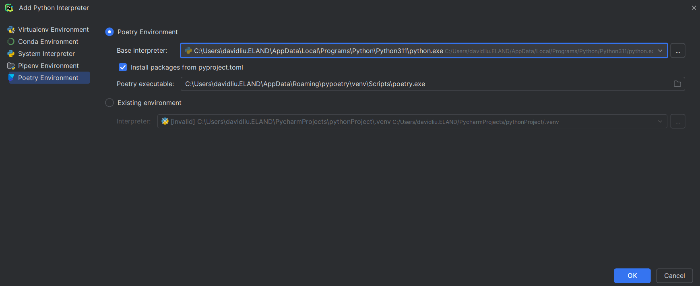
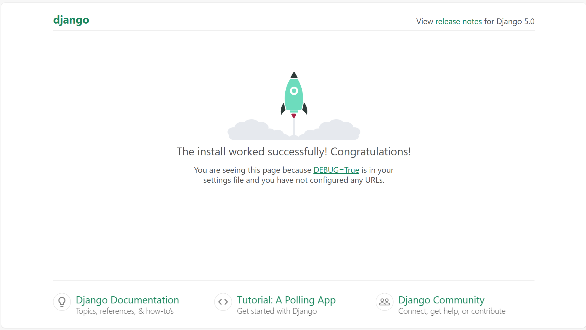

# Day 2 - 介紹甚麼是 Django、安裝、開發環境
- 開發IDE
- 安裝pyhton、django
- 設置虛擬環境(使用poetry)

## 一、什麼是 Django 
Django 是一個 python 的 Web 框架它提供了豐富的工具和內置功能，主要應用於構建各種類型的Web應用程序，
例如: 新聞網站、網路商店、拍賣網站、企業內部管理系統、為前端框架( Vue、React )提供後端 API 服務等。

#### 那位甚麼要使用Django!
主要是高效的開發速度，它的內置工具和模塊化設計，使得開發者能夠快速構建。它有自帶管理後後台，使得管理數據和用戶變得非常簡單和直觀。再來就是 Django 強大的 ORM 使得與數據庫的交互變得簡單，允許開發者使用 Python 來操作數據庫，而不需要寫 SQL 語法。
它也內置了多層安全機制，幫助開發者避免常見的安全漏洞，如SQL注入、跨站腳本攻擊（XSS）、跨站請求偽造（CSRF）等。


## 二、開發IDE

我個人是使用 PyCharm 它是一個強大的 Python 開發環境（IDE），非常適合 Django 開發，那它有分為付費版和免費的( 如果平常很常用到的話建議可以花錢買付費版的因為實在好用非常多，如果你還是學生的話可以[免費使用付費版的](https://medium.com/python-note/%E5%85%8D%E8%B2%BB%E7%8D%B2%E5%BE%97-pycharm-professional-%E7%9A%84%E6%96%B9%E6%B3%95-9a5249a86ede)，可以自行前往察看如何使用。)

#### 安裝 [PyCharm](https://www.jetbrains.com/pycharm/download/?source=google&medium=cpc&campaign=APAC_en_JP_PyCharm_Branded&term=pycharm&content=698987581560&gad_source=1&gclid=CjwKCAjw4ri0BhAvEiwA8oo6F3C_AxvntKRz9hdSrA6QMnMv7ERO6skouemtEXcrzBW93a5OiXLrTRoCIFgQAvD_BwE&section=windows)
1. 先選擇社區版（免費）或專業版。
2. 下載並安裝 PyCharm。
3. 完成安裝後，打開 PyCharm。

## 三、下載 python、設置虛擬環境、安裝 django

#### 下載 [python](https://www.python.org/downloads/)

1. 下載適合你操作系統的最新版本
2. 照著安裝步驟進行安裝，確保選擇“Add Python to PATH”選項
3. 安裝好後可以打開 CMD 或終端，輸入命令確認是否安裝成功
    ```commandline
    python --version
    ```
#### 設置虛擬環境 [(這邊有官方教學可以看)](https://www.jetbrains.com/help/dataspell/poetry.html#cbc399de)
我是使用 poetry 來管理套件及虛擬環境，相較於 pip 比較複雜但是比 pip 強大許多

1. 安裝 poetry  
   official installer 安裝 Poetry，只要在命令列輸入下列指令  
   **macOS / Linux / WSL**
    ```
   curl -sSL https://install.python-poetry.org | python3 -
   ``` 
   **Windows**
    ```
   (Invoke-WebRequest -Uri https://install.python-poetry.org -UseBasicParsing).Content | python -
   ```
   安裝好後可以打開 CMD 或終端，輸入命令確認是否安裝成功
   ```
   poetry --version
   ```  
     
2. 建立虛擬環境  
   可以透過`ctrl+shift+p` 打開Settings  

   
   - 選擇`Add Local Interpreter`  
   <br>
   
   
   - 選擇`Poetry Envvironment`，`Base interpreter`選擇你下載的Python版本就可以建立了  
   <br>  
   
   
   - 可以確認右下角是否有顯示Poetry的圖示，代表成功建立虛擬環境  
   <br>

3. 安裝 Django  
   在終端輸入下列指令安裝 Django
   ```
   poetry add django
   ```
    安裝好後可以打開 CMD 或終端，輸入命令確認是否安裝成功
    ```
    django-admin --version
    ```

4. 啟動 Django  

   - 創建完成後，可以透過下列指令確認是否有創建成功：
   ```commandline
   python manage.py runserver
   ```
   - 終端機會顯示以下畫面
   
   - 接著點開地端網址以及port號看到以下畫面代表成功安裝
   

## 四、參考資料
- https://blog.kyomind.tw/python-poetry/
- https://aws.amazon.com/tw/what-is/django/
- https://ithelp.ithome.com.tw/m/articles/10292317