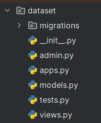
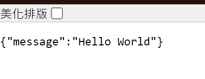

# Day 5 - 建立第一個 app 以及簡易的 API
- 介紹 app
- 建立、註冊 app
- 建立簡易的 Django API

## 一、甚麼是 app
Django app 是一個獨立的模塊或組件，每個 app 可以獨立開發和測試，它包含了模型、視圖、模板等等，以實際例子來說明，假如我想要建立一個線上書店，就會分別需要有管理使用者和書籍的 app 等等。

## 二、建立、註冊app
昨天建立完專案之後今天我們要建立一個 Django app，並註冊到專案中。

1. 建立 app
    ```commandline
    python manage.py startapp dataset
    ```
    - `dataset` 是 app 的名稱，可以自行更改
    - 執行完後會看到 app 的結構如下:  
    
        - models.py: 定義模型
        - views.py: 定義視圖
        - admin.py: 註冊模型到管理站台
        - apps.py: app 的配置文件
        - migrations: 存放數據庫遷移文件
        - tests.py: 測試文件 
   

2. 註冊 app

    - 在專案的 `settings.py` 中的 `INSTALLED_APPS` 中加入剛剛建立的 app
        ```python
        INSTALLED_APPS = [
            ...
            'dataset',
        ]
        ```

3. 設定路由
    - 在 app 中創建一個`urls.py`檔案
    - 在專案的 `urls.py` 中加入 app 的路由
        ```python
        from django.urls import path, include
        urlpatterns = [
        path('admin/', admin.site.urls),
        path('dataset/', include('dataset.urls')),
        ]
       ```

## 三、建立簡易的 Django API
在這部分，我將示範如何建立一個簡單的 Django API 來回傳 "Hello World"。這個例子能幫助你了解 Django 的基本視圖和路由設置，為後續構建更複雜的 API 打下基礎。

1. 在 `views.py` 中建立一個 function 回傳 Hello World
    ```python
    from django.http import HttpResponse

    # Create your views here.
    def hello_world(request):
        return HttpResponse("Hello World")
   ```
2. 在 `urls.py` 建立對應的路由和 views 進行連結
    ```python
    from django.urls import path
    from dataset import views

    urlpatterns = [
        path('hello/', views.hello_world),
    ]
    ```
3. 啟動服務
    ```commandline
    python manage.py runserver
    ```
   
4. 打開瀏覽器輸入 `http://127.0.0.1:8000/dataset/hello/` 看到以下實際畫面就成功了  

    

> 我們也可以使用 JSON 回應，因為這可以提高 API 的兼容性和靈活性，符合現代Web開發的需求和最佳實踐。因此，將簡單的文本回應改為JSON回應是很有必要的，特別是在開發 RESTful API (下一章節會提到) 時。

下方是示例
```python
from django.http import JsonResponse

# Create your views here.
def hello_world(request):
    return JsonResponse({"message": "Hello World"})
```
打開瀏覽器後會看到以下實際畫面  


## 參考資料
- https://blog.kyomind.tw/django-rest-framework-01/
- https://ithelp.ithome.com.tw/m/articles/10289337